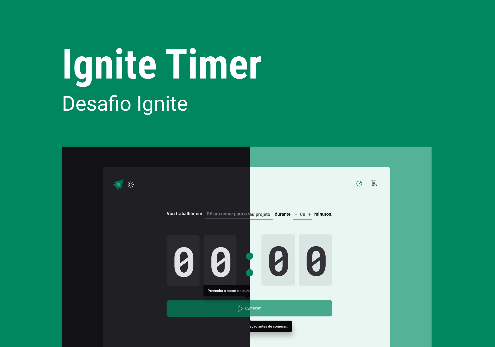

> Ignite - Projeto #2

# Timer

## Sobre o projeto

Esse projeto consiste em uma aplicação de timer, que contém as seguintes funcionalidades:

- Adicionar um novo ciclo
- Interromper um clico
- Exibir uma lista de ciclos
- Excluir um ciclo da lista
- Alterar o tema entre `light` e `dark`

## O que foi usado

- React
- TypeScript
- Vite
- Tailwind
- Tailwind-Variants
- React Router
- React Hook Form
- Zod
- Immer
- Eslint
- Prettier

> O projeto original não inclui Tailwind, Eslint e Prettier
